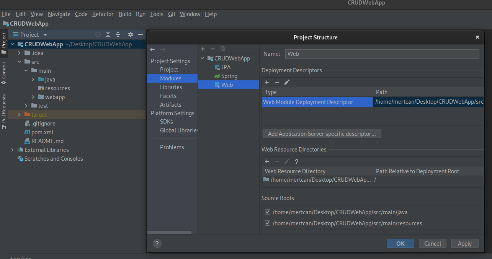
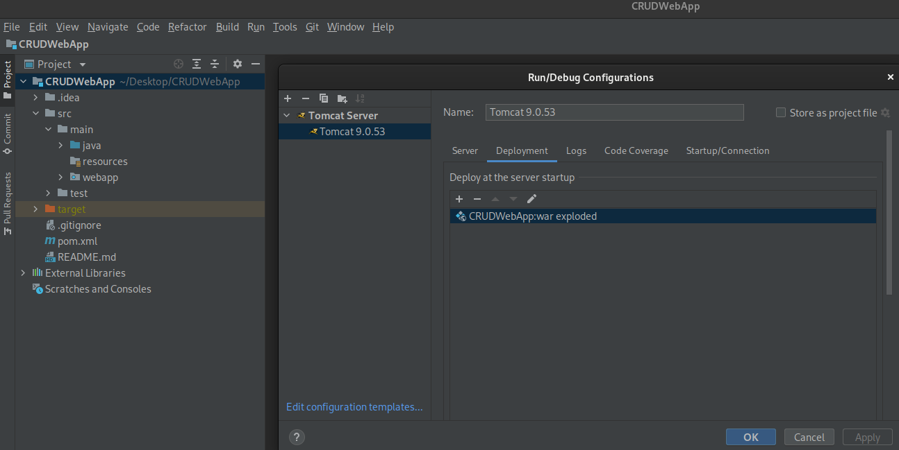

# Spring MVC Starter Pack

This repository includes Spring MVC starter files and guide to deploy it on local Tomcat Server. All files are given in the repo. So, below you can find the deployment steps.

### Deployment

- Before proceeding with the deployment process, make sure that your file structure looks exactly the same as below.

- If you can't see a blue sign in the webapp folder that hosts the web files, press the F4 key on the main folder of the project and add the configurations as in the figure.

- Then set the Local Tomcat Server using the Edit Configurations tab next to the Run button as shown below. Deploy the war file in the Deployment section. Your project will become operational.
